# CMOS Circuit Design and Analysis

This repository summarizes a 5-day CMOS circuit design workshop conducted by Kunal Ghosh, covering transistor fundamentals, SPICE-based analysis, CMOS inverter behavior, noise margins, and robustness across power supply and device variations. It is organized day-by-day to build concepts progressively from basic NMOS operation to practical design evaluation.

## Table of Contents

- [Day 1: Basics of NMOS Drain Current (Id) vs Drain-to-source Voltage (Vds)](#day-1-basics-of-nmos-drain-current-id-vs-drain-to-source-voltage-vds)
  - [Circuit Fundamentals](#circuit-fundamentals)
  - [Part 1: Introduction to Circuit Design and SPICE simulations](#part-1-introduction-to-circuit-design-and-spice-simulations)
  - [Drain Current (ID) Expressions by Operating Region](#drain-current-id-expressions-by-operating-region)
  - [Part 2: NMOS Resistive region and Saturation region of operation](#part-2-nmos-resistive-region-and-saturation-region-of-operation)
  - [Part 3: Introduction to SPICE](#part-3-introduction-to-spice)
- [Day 2: Velocity Saturation and basics of CMOS inverter VTC](#day-2-velocity-saturation-and-basics-of-cmos-inverter-vtc)
  - [Part 1: SPICE simulation for lower nodes and velocity saturation effect](#part-1-spice-simulation-for-lower-nodes-and-velocity-saturation-effect)
  - [Load Curves Analysis](#load-curves-analysis)
  - [Part 2: CMOS voltage transfer characteristics (VTC)](#part-2-cmos-voltage-transfer-characteristics-vtc)
  - [Voltage Transfer Characteristics](#voltage-transfer-characteristics)
- [Day 3: CMOS switching threshold and dynamic simulations](#day-3-cmos-switching-threshold-and-dynamic-simulations)
  - [Part 1: Voltage transfer characteristics and SPICE simulations](#part-1-voltage-transfer-characteristics-and-spice-simulations)
  - [Timing Parameters](#timing-parameters)
  - [Part 2: Static Behavior Evaluation - CMOS Inverter Robustness: Switching threshold](#part-2-static-behavior-evaluation---cmos-inverter-robustness-switching-threshold)
- [Day 4: CMOS Noise Margin Robustness Evaluation](#day-4-cmos-noise-margin-robustness-evaluation)
  - [Part 1: Static Behavior Evaluation - CMOS Inverter Robustness: Noise Margin](#part-1-static-behavior-evaluation---cmos-inverter-robustness-noise-margin)
  - [Noise Margins](#noise-margins)
- [Day 5: CMOS Power supply and device variation robustness evaluation](#day-5-cmos-power-supply-and-device-variation-robustness-evaluation)
  - [Part 1: Static Behavior Evaluation - CMOS Inverter Robustness: Power Supply Variation](#part-1-static-behavior-evaluation---cmos-inverter-robustness-power-supply-variation)
  - [Part 2: Static Behavior Evaluation - CMOS Inverter Robustness: Device Variation](#part-2-static-behavior-evaluation---cmos-inverter-robustness-device-variation)
- [Conclusion](#conclusion)
- [References](#references)

---

# **Day 1: Basics of NMOS Drain Current (Id) vs Drain-to-source Voltage (Vds)**

On the first day of the workshop, we explored the fundamental building blocks of digital circuits. We learned how NMOS transistors work, how to characterize their current-voltage behavior, and how to simulate real-world devices using SPICE. This foundation is critical because CMOS inverter performance depends entirely on understanding individual transistor operation.


## **Part 1: Introduction to Circuit Design and SPICE Simulations**


**Why do we need SPICE for CTS?**

In Clock Tree Synthesis (CTS), the goal is to deliver the clock edge to all sequential elements with minimum skew and controlled insertion delay. Since setup and hold margins are very small, CTS depends on highly accurate cell delay models.

We need SPICE in CTS because:
- **Clock paths are timing-critical**: even picosecond-level delay mismatch can create skew and timing violations
- **Delay is strongly context-dependent**: buffer/inverter delay changes with input slew, output load, VDD, temperature, and process corner
- **SPICE captures device-level non-idealities**: short-channel effects, parasitics, body effect, and rise/fall asymmetry

In short, SPICE provides the transistor-level accuracy required for reliable CTS decisions and timing signoff.


### **Understanding the Delay Table in Clock Tree Synthesis (CTS) Context**

**Why This Delay Table is Critical for CTS:**

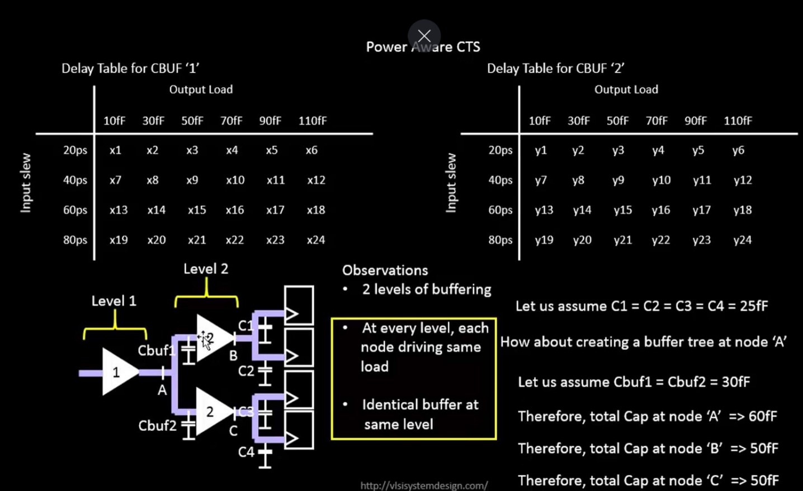


The delay table above represents one of the most important design principles in Clock Tree Synthesis. Here's why each ratio matters:

**The CTS Fundamental Principle:**
- Clock distribution requires **symmetric rise and fall times** to minimize clock skew across the chip
- Skew occurs when clock edges arrive at different flip-flops at different times
- Different skew values cause setup/hold time violations and data corruption


**Calculating the delay of CBUF1:**
- For an input slew of 40ps & output load of 60fF.
- The intersection of these two rows and coloums in the delay table, tells the delay of CBUF1 is x9 and x10.

**Calculating the delay of CBUF2:**
- For an input slew of 60ps & output load of 50fF.
- The intersection of these the row and coloum in the delay table, tells the delay of CBUF1 is y15.

### **Understanding NMOS: The Building Block**

**What is an NMOS Transistor?**

An NMOS (N-channel Metal-Oxide-Semiconductor) transistor is a four-terminal switching device that forms the foundation of modern digital circuits. Let’s understand its structure step-by-step:

**Step 1: Construction of NMOS**

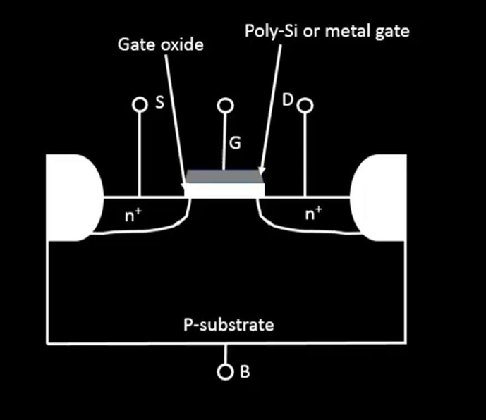

The NMOS transistor consists of:
- **P-type Substrate**: The base material (body or bulk - B terminal)
- **SiO₂ Isolation Region**: Insulates the device from neighboring transistors
- **N+ Diffusion Regions**: Two highly doped n-type regions that act as Source (S) and Drain (D)
- **Gate Oxide Layer (SiO₂)**: Thin insulating layer between gate and channel (~3nm thick)
- **Poly-Silicon Gate**: Metal layer on top of oxide that controls transistor operation (G terminal)

**The Four Terminals:**
- **Gate (G)**: Controls whether the transistor is ON or OFF
- **Source (S)**: Reference point (typically grounded, at 0V)
- **Drain (D)**: Where current flows out
- **Body/Bulk (B)**: Substrate connection (usually at ground potential)

---

**Step 2: How NMOS Works - The Turn-ON Process**

When we apply voltage to the gate, an extraordinary physical phenomenon occurs:

**When Vgs = 0V (No Gate Voltage):**
- No electric field exists between gate and substrate
- The region under the oxideis still p-type silicon
- No conducting path exists between Source and Drain
- **Transistor is OFF** - no current flows

**As we increase Vgs (Applying Positive Gate Voltage):**
- A positive electric field pulls electrons from the p-substrate toward the oxide layer
- Electrons accumulate at the Si-SiO₂ interface
- When Vgs reaches a critical voltage (threshold voltage Vt), these electrons form a conducting channel
- **Strong Inversion occurs**: p-type substrate converts locally to n-type beneath the gate

**When Vgs > Vt (Gate Voltage exceeds Threshold):**
- A continuous n-type channel forms connecting Source to Drain
- This channel acts like a resistor whose resistance depends on Vgs
- Current can now flow from Drain to Source through this channel
- **Transistor is ON** and can conduct current

---

**Step 3: Threshold Voltage (Vt) - The Switching Point**

**Definition:**
Threshold voltage Vt is the minimum gate-to-source voltage (Vgs) required to create a conducting channel.

**Mechanism:**

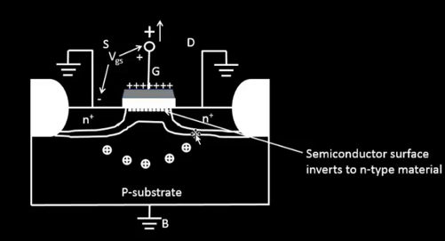

At threshold:
- Sufficient charge accumulates at the Si surface to just form an inversion layer
- Below Vt: Majority carriers repelled, minority carriers insufficient → No conduction
- Above Vt: Strong inversion → Continuous conducting path

**Impact of Source-to-Bulk Voltage (Vsb):**


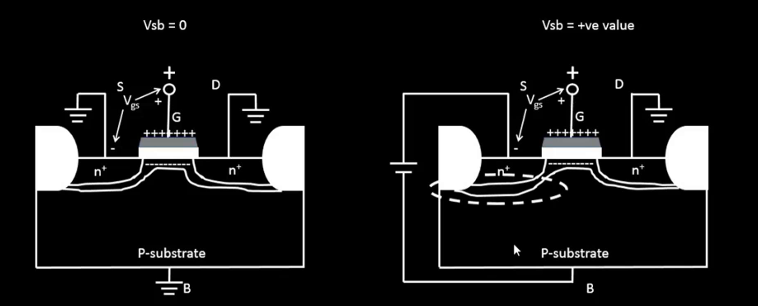

In real circuits, the source may not be at ground potential (Vsb ≠ 0):
- When Vsb increases (source raised above bulk), the threshold voltage increases
- This "body effect" requires higher Vgs to turn ON the transistor
- Equation:

$$
V_t = V_{t0} + \gamma \left(\sqrt{\left|-2\phi_f + V_{sb}\right|} - \sqrt{\left|-2\phi_f\right|}\right)
$$


Where:
- **Vt0**: Threshold voltage when Vsb = 0
- **γ (gamma)**: Body effect coefficient (≈ 0.4V^0.5 in SKY130)
- **φF**: Fermi Potential (≈ 0.35V)

---

**Step 4: Gate Oxide Capacitance (Cox) - Coupling the Gate Signal**

**Why Cox matters:**

The gate oxide acts as a capacitor:
- Formula: **Cox = εox × εo / tox**

Where:
- **εox**: Relative permittivity of SiO₂ ≈ 3.97
- **εo**: Permittivity of free space = 8.85 × 10⁻¹² F/m
- **tox**: Oxide thickness (critical process parameter)

For SKY130 technology:
- Oxide thickness ≈ 1.8nm
- Cox ≈ 1.8 mF/cm²
- Thinner oxide → Higher Cox → Better charge coupling → Better transistor control

**Importance:** Cox directly affects kn’ (process transconductance parameter), which determines how much current the transistor can deliver for a given Vgs.


**Equations:**

- Threshold voltage with body effect:

$$
V_t = V_{t0} + \gamma \left(\sqrt{\left|-2\phi_f + V_{sb}\right|} - \sqrt{\left|-2\phi_f\right|}\right)
$$

- Body-effect coefficient:

$$
\gamma = \frac{\sqrt{2qN_A\varepsilon_{si}}}{C_{ox}}
$$

- Fermi potential:

$$
\phi_f = -\phi_T\ln\left(\frac{N_A}{n_i}\right)
$$

**Terms used:**
- **Vt**: Threshold voltage with substrate bias applied
- **Vt0**: Threshold voltage when Vsb = 0
- **Vsb**: Source-to-bulk voltage
- **γ**: Body-effect coefficient (unit: V^0.5)
- **φf**: Fermi potential of the substrate
- **q**: Electron charge (1.602 × 10^-19 C)
- **NA**: Acceptor doping concentration in substrate
- **εsi**: Silicon permittivity (relative value ≈ 11.7)
- **Cox**: Gate oxide capacitance per unit area
- **φT**: Thermal voltage (kT/q, about 25.9mV at 300K)
- **ni**: Intrinsic carrier concentration of silicon
---

**Step 5: Vds > 0 is applied (Vgs > Vt)**

**The Charge Distribution Along the Channel:**

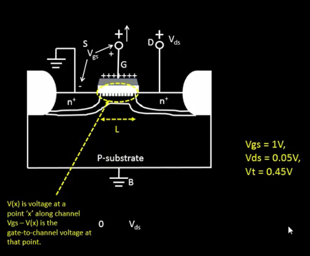

When the transistor conducts:
- Charge density at any point x along the channel: **Qi(x) = -Cox × [Vgs - V(x) - Vt]**
- V(x) varies from 0V at source to Vds at drain
- Charge distribution is non-uniform - more charge near source, less near drain
- This *triangular* charge distribution is crucial for understanding saturation

**Physical Insight:**
- At source end: Full Vgs available, maximum charge density
- At drain end: Reduced voltage (V(x) increases toward Vds), reduced charge density
- Channel gets "pinched" near the drain at saturation conditions

---

**Step 6: Drift Current - Electrons in Motion**

**How Current Flows:**

The current in the channel comes from two mechanisms:
1. **Drift Current**: Motion due to electric field (dominant in saturated devices)
   - Caused by potential difference (Vds) pushing electrons toward drain
   - Velocity: v = μ × E where E is electric field, μ is mobility

2. **Diffusion Current**: Motion due to concentration gradient (minor at room temperature)
   - Electrons tend to spread from high-density to low-density regions

**The Drift Current Formula:**

For long-channel NMOS (gradual-channel approximation), the drift current derivation is:

1. Inversion charge density at position $x$:

$$
Q_i(x) = -C_{ox}[V_{GS}-V_T-V(x)]
$$

2. Carrier drift velocity in the channel:

$$
v(x) = \mu_n E_x = -\mu_n\frac{dV}{dx}
$$

3. Drain current through channel width $W$:

$$
I_{DS} = -W\,Q_i(x)\,v(x)
$$

Substituting $Q_i(x)$ and $v(x)$:

$$
I_{DS} = \mu_n C_{ox}W[V_{GS}-V_T-V(x)]\frac{dV}{dx}
$$

4. Integrate from source to drain, using $V(0)=0$ and $V(L)=V_{DS}$:

$$
\int_0^L I_{DS}\,dx
=\mu_n C_{ox}W\int_0^{V_{DS}}(V_{GS}-V_T-V)\,dV
$$

$$
I_{DS}L
=\mu_n C_{ox}W\left[(V_{GS}-V_T)V_{DS}-\frac{V_{DS}^2}{2}\right]
$$

5. Final long-channel linear-region current equation:

$$
I_{DS}=\mu_n C_{ox}\frac{W}{L}\left[(V_{GS}-V_T)V_{DS}-\frac{V_{DS}^2}{2}\right]
$$

Breaking this down:
- **μn**: Electron mobility in substrate (≈ 600 cm²/V·s for electrons)
- **Cox**: Gate oxide capacitance per unit area
- **(W/L)**: Transistor aspect ratio
- **[(Vgs - Vt)Vds - Vds²/2]**: Accounts for charge distribution variation

**Important Definitions:**
- **kn’ = μn × Cox**: Process transconductance parameter (technology-dependent)
- **kn = kn’ × (W/L)**: Gain factor (design-dependent)

---

**Step 7: NMOS Operating Regions - The Three Modes**

**Overview of Operating Regions:**

The NMOS transistor has three distinct operating regions:

**Region 1: Cutoff (OFF)**
- **Condition**: Vgs < Vt
- **Current**: Id ≈ 0 (leakage only)
- **Used for**: Logic ‘0’ output, switch OFF
- **Behavior**: No channel exists

**Region 2: Linear/Triode (Resistive Mode)**
- **Condition**: Vgs > Vt AND Vds < (Vgs - Vt)
- **Current**: **Id = kn[(Vgs - Vt)Vds - Vds²/2]**
- **Simplified**: **Id ≈ kn(Vgs - Vt)Vds** (when Vds is small)
- **Used for**: Pull-down switches, output transition
- **Behavior**: Acts like a voltage-controlled resistor
  - Current increases roughly linearly with Vds
  - Transistor is barely saturated

**Region 3: Saturation (Current Source Mode)**
- **Condition**: Vgs > Vt AND Vds ≥ (Vgs - Vt)
- **Current**: **Id = (kn/2)(Vgs - Vt)² × (1 + λVds)** (with channel length modulation)
- **Simplified**: **Id ≈ (kn/2)(Vgs - Vt)²** (ideal case)
- **Used for**: Pull-down driving in CMOS inverter, logic swing
- **Behavior**: Acts like a voltage-controlled current source
  - Current becomes nearly independent of Vds
  - Transistor is fully saturated
  - Channel pinches off at drain end

---

**Step 8: Physical Mechanisms - Saturation and Pinch-Off**

**Why does saturation occur?**

**The Pinch-Off Phenomenon:**

1. **At Low Vds (Linear Region)**:
   - Channel remains open throughout
   - Charge available decreases gradually from source to drain
   - Current increases with Vds

2. **At Higher Vds (Approaching Saturation)**:
   - Channel voltage at drain: V(x=L) = Vds
   - At drain end, the voltage drop becomes: Vgs - Vds - Vt
   - When Vds = Vgs - Vt, this becomes ZERO at drain
   - Channel starts to "pinch off" near the drain
   - Triangular  charge distribution forms

3. **At Full Saturation (Vds ≥ Vgs - Vt)**:
   - Pinch-off point moves away from drain
   - Effected channel length shortens
   - With simplified model: Vdsat = Vgs - Vt (saturation voltage)
   - Current becomes independent of further Vds increase

**Channel Length Modulation (λ effect):**

In real devices, saturation isn’t perfect:
- **Id = (kn/2)(Vgs - Vt)² × (1 + λVds)**
- As Vds increases, pinch-off point moves toward source
- Effective channel length decreases
- Current increases slightly even in saturation
- λ (lambda) ≈ 0.05 - 0.1 for long-channel, higher for short-channel

---

### **Why SPICE Simulation is Essential**


**What SPICE Provides:**

SPICE (Simulation Program with Integrated Circuit Emphasis) solves the transistor equations numerically:
1. **Accuracy**: Models account for process variations, temperature, parasitics
2. **Verification**: Confirms circuit behavior before fabrication
3. **Design Exploration**: Quickly optimize W/L ratios for performance/power tradeoffs
4. **Practical Predictions**: Id vs Vds curves match measured silicon
5. **Transient Analysis**: Predicts propagation delays, rise/fall times

**SPICE in SKY130:**

The SKY130 process provides models that capture:
- Short-channel effects (L = 150nm, approaching velocity saturation)
- Velocity saturation (carriers can’t go faster than ~10^7 cm/s)
- Process corners (fast/slow NMOS and PMOS variations)
- Temperature effects (kn and Vt change with T)
- Supply voltage scaling effects (crucial for low-power designs)

**Limitations of Hand Analysis:**

Hand calculations give us insight, but real devices are complex:
- Process variations affect Vt and kn’
- Temperature changes mobility (μ changes with T)
- High-field effects cause velocity saturation in short-channel devices
- Parasitic capacitances affect timing
- Second-order effects (body effect, DIBL, etc.) become significant

---

### **_Lab Activity:_**

- The spice waveforms can be used to calculate the delay of a cell. These delays are very close to the practical delays observed.

- R1 resistance is added as it is not desired that the current from Vin would be directly fed to the gate of M1.

- **Definition of nodes and how to identify them**
   - A node is a point where two or more terminals are electrically connected. If two terminals of the same device are shorted, the connection between them is also a node. In most practical circuits, a node connects terminals from different devices.
   - To identify nodes, read the SPICE netlist: any terminals that share the same net name belong to the same node.

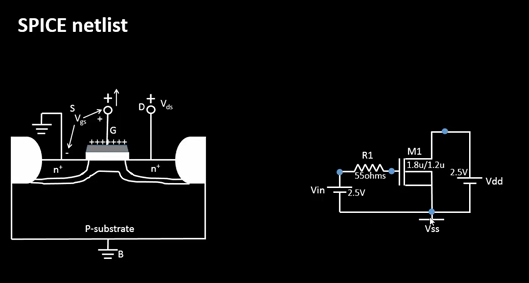

For performing the Day 1 Lab activity we need the following code:
```
*Model Description
.param temp=27

*Including sky130 library files
.lib "sky130_fd_pr/models/sky130.lib.spice" tt

*Netlist Description

XM1 Vdd n1 0 0 sky130_fd_pr__nfet_01v8 w=5 l=2
R1 n1 in 55
Vdd vdd 0 1.8V
Vin in 0 1.8V

*simulation commands

.op
.dc Vdd 0 1.8 0.1 Vin 0 1.8 0.2

.control

run
display
setplot dc1
.endc

.end
```

- There are five types of process corners available for use:
    - tt -> Typical corner
    - sf -> Slow-fast corner
    - ff -> Fast-fast corner
    - ss -> Slow-slow corner
    - fs -> Fast-slow corner
- In the Lab activity, tt corner is used. The corner can be changed by changing the word 'tt' in the line `.lib "sky130_fd_pr/models/sky130.lib.spice" tt` with any valid process corner


- To observe the value of Id at any point on the curve, then left click on the point on the curve to be observed.
- Now on the terminal window, some values of x0 and y0 should appear.
- The value of Id corresponds to the value of y0 in ampere.

# **Day 2: Velocity Saturation and CMOS Inverter VTC**

On the second day, we examined how transistor behavior changes at smaller technology nodes. Modern devices (L < 250nm) exhibit velocity saturation, which fundamentally alters the Id-Vds characteristics. We also explored how NMOS and PMOS work together in a CMOS inverter to create the Voltage Transfer Characteristic (VTC).

## **Part 1: SPICE Simulation for Lower Nodes and Velocity Saturation**

### Understanding Technology Nodes: Short vs Long

**What Defines a Technology Node?**

A technology node refers to the minimum feature size (channel length L) that can be reliably manufactured. As we scale down:

| Node Type | Channel Length | Behavior | Example |
|-----------|---------------|----------|---------|
| **Long Node** | L > 250nm | Classical square-law | 500nm, 350nm |
| **Short Node** | L < 250nm | Velocity saturation dominant | 180nm, 130nm, 65nm, 45nm, 28nm |

**Why Does Node Size Matter?**

At shorter nodes, the electric field (E = Vds/L) becomes very high. This causes electrons to reach their maximum velocity earlier, fundamentally changing the device characteristics.

---

### Short Node Device Behavior (L < 250nm)

**The Physics of Velocity Saturation:**

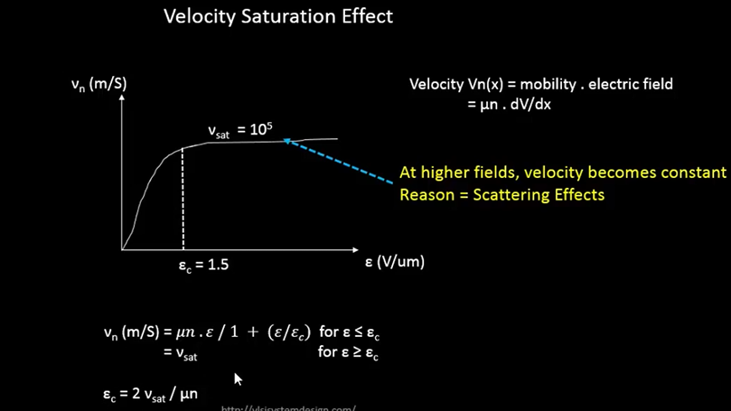

In a short node device, electrons don’t accelerate infinitely with increasing electric field. There’s a physical limit to how fast they can travel through the silicon lattice.

At low electric fields:
- Carrier velocity increases linearly with field: **v = μ × E**
- Mobility μ determines how easily carriers move

At high electric fields (E > Ec, the critical field):
- Velocity saturates at **vsat ≈ 10⁷ cm/s**
- Further increasing Vds doesn’t increase velocity
- This is the "velocity saturation" effect

The transition occurs at the critical field **Ec ≈ 1.5 MV/cm** for electrons in silicon.

**Velocity Saturation Visualization:**

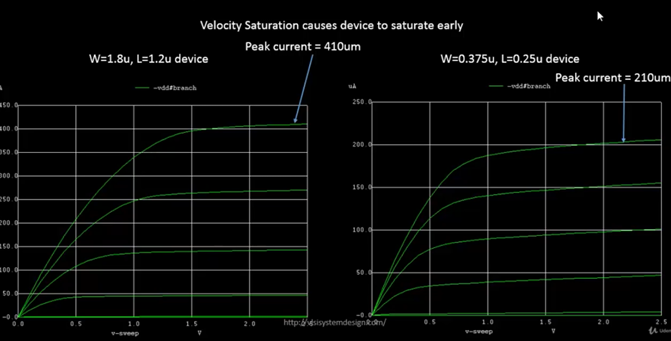

**Observations**

- The saturation Id current observed in long channel is 410um and for that of a short channel is 210um. 
- The saturation current of short channel device is significantly reduced. 

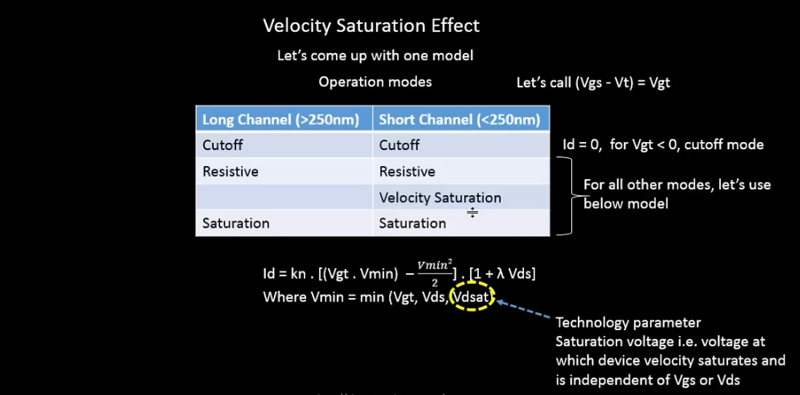
---


### Impact on Operating Regions

**Long Node Device (L > 250nm) - Three Regions:**

1. **Cutoff**: Vgs < Vt → Id = 0
2. **Linear**: Vgs > Vt, Vds < (Vgs - Vt) → Id = kn[(Vgs-Vt)Vds - Vds²/2]
3. **Saturation**: Vgs > Vt, Vds ≥ (Vgs - Vt) → Id = (kn/2)(Vgs-Vt)²

**Short Node Device (L < 250nm) - Four Regions:**

1. **Cutoff**: Vgs < Vt → Id = 0
2. **Linear**: Vds < min(Vgt, Vdsat) → Id = kn[(Vgs-Vt)Vds - Vds²/2]
3. **Velocity Saturation**: Vdsat < min(Vgt, Vds) → **Id = kn(Vgs-Vt)Vdsat**
4. **Saturation**: Vgt < min(Vdsat, Vds) → Id = (kn/2)(Vgs-Vt)²

Where:
- **Vgt = Vgs - Vt** (overdrive voltage)
- **Vdsat** = voltage at which velocity saturates (technology parameter, ~0.6V for SKY130)
---

**The Critical Equation for Short Nodes:**

The unified current equation considering velocity saturation:

```
If Vds < min(Vgt, Vdsat):
    Id = kn × Vgt × Vds - kn × Vds²/2    [Linear]

Else if Vdsat < min(Vgt, Vds):
    Id = kn × Vgt × Vdsat                [Velocity Saturation - LINEAR in Vgt]

Else:
    Id = (kn/2) × Vgt²                   [Square-law Saturation]
```

**Key Insight:** In SKY130 technology (L = 150nm), devices operate primarily in velocity saturation mode. This means Id ∝ (Vgs - Vt), not (Vgs - Vt)².

---

### NMOS Operating Regions Overview

### Threshold Voltage Extraction

**How to Determine Vt from Simulation:**

The threshold voltage can be extracted from the Id vs Vgs characteristic:

**Method:**
1. Plot Id vs Vgs at fixed Vds (typically Vds = Vdd/2)
2. Find the linear region where Id rises with Vgs
3. Draw a tangent line to this linear portion
4. Extend the tangent to intersect the Vgs axis
5. The intercept point gives Vt

For SKY130 NMOS: Vt ≈ 0.45V to 0.55V (varies with process)

---

### **_Lab Activity: Short Node Device Characterization_**

**Objective:** Plot Id vs Vds for a short node (L = 150nm) NMOS device.

**SPICE Code:**
```
*Model Description
.param temp=27

*Including sky130 library files
.lib "sky130_fd_pr/models/sky130.lib.spice" tt

*Netlist Description

XM1 Vdd n1 0 0 sky130_fd_pr__nfet_01v8 w=0.39 l=0.15
R1 n1 in 55

Vdd vdd 0 1.8V
Vin in 0 1.8V

*simulation commands

.op
.dc Vdd 0 1.8 0.1 Vin 0 1.8 0.2

.control

run
display
setplot dc1
.endc

.end
```

**Output:**

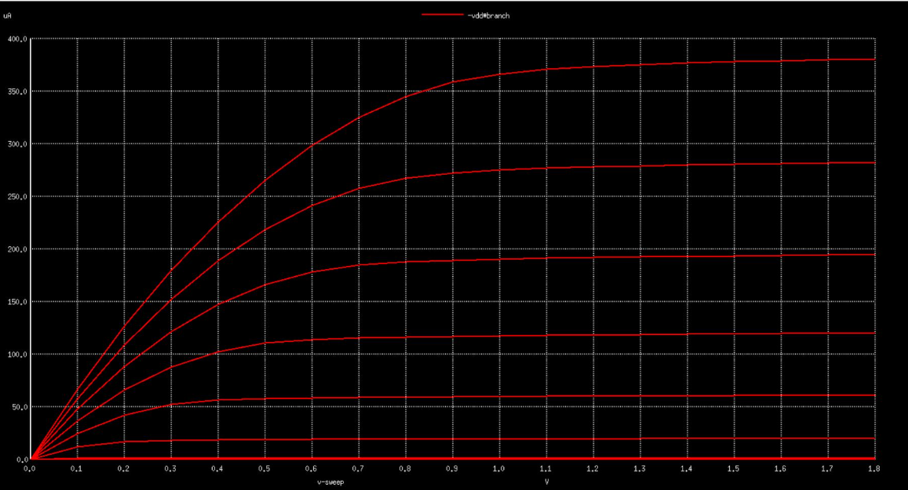


**Lab Results:**
- Observe how the device saturates earlier compared to long node

**Short Node Id-Vgs Characteristics:**

**Objective:** Plot Id vs Vgs for a short node (L = 150nm) NMOS device.

**SPICE Code:**

```
*Model Description
.param temp=27

*Including sky130 library files
.lib "sky130_fd_pr/models/sky130.lib.spice" tt

*Netlist Description
XM1 Vdd n1 0 0 sky130_fd_pr__nfet_01v8 w=0.39 l=0.15
R1 n1 in 55

Vdd vdd 0 1.8V
Vin in 0 1.8V

*simulation commands

.op
.dc Vin 0 1.8 0.1

.control

run
display
setplot dc1
.endc

.end
```

**Output:**

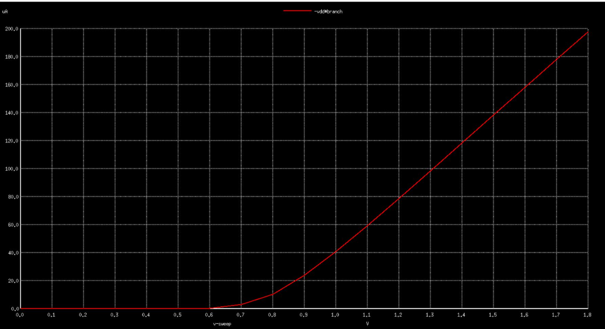

**Result Analysis:**
- Extend the linear portion of Id vs Vgs to the x-axis
- Note the linear relationship between Id and Vgs in saturation but in case of a long channel, it is quadratic.
- Measure the threshold voltage using the tangent method
- The x-intercept gives the threshold voltage
- For this device: Vt ≈ 0.45V

---

## **Part 2: CMOS Inverter and Voltage Transfer Characteristics**

### MOSFET as a Switch

**The Fundamental Switching Concept:**

Both NMOS and PMOS act as voltage-controlled switches:


| Condition | NMOS Behavior | PMOS Behavior |
|-----------|---------------|---------------|
| \|Vgs\| < \|Vt\| | OFF (Infinite resistance) | OFF (Infinite resistance) |
| \|Vgs\| > \|Vt\| | ON (Finite resistance Ron) | ON (Finite resistance Ron) |

**Key Point:** NMOS turns ON with HIGH gate voltage, PMOS turns ON with LOW gate voltage (complementary behavior).

---

### CMOS Inverter Structure

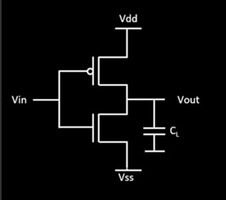

**The CMOS inverter consists of:**
- **PMOS** (top): Connected between Vdd and output - acts as pull-up
- **NMOS** (bottom): Connected between output and ground - acts as pull-down
- **Load capacitance CL**: Represents the input of the next stage

**Individual Transistor Roles:**

The NMOS provides:
- Pull-down path when gate is HIGH
- Low resistance to ground when ON
- High resistance (OFF) when gate is LOW

The PMOS provides:
- Pull-up path when gate is LOW
- Low resistance to Vdd when ON
- High resistance (OFF) when gate is HIGH

---

### CMOS Inverter Operation

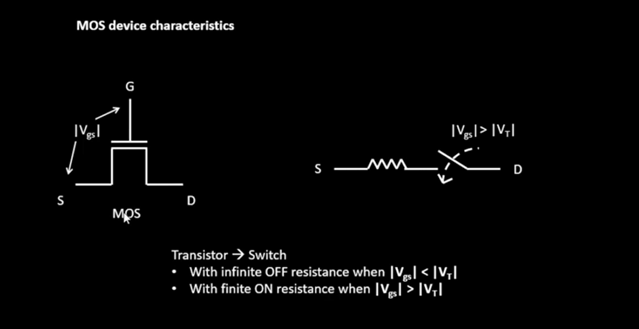

**How the Complementary Action Works:**

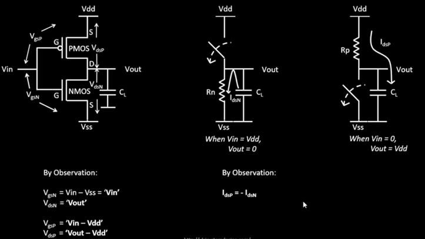

**Case 1: Input = LOW (Vin = 0V)**
- NMOS: Vgs_n = 0V < Vt_n → **OFF**
- PMOS: Vgs_p = 0 - Vdd = -Vdd, |Vgs_p| > |Vt_p| → **ON**
- Result: Direct path from Vdd to output through PMOS
- **Output = HIGH (Vdd)**

**Case 2: Input = HIGH (Vin = Vdd)**
- NMOS: Vgs_n = Vdd > Vt_n → **ON**
- PMOS: Vgs_p = Vdd - Vdd = 0V, |Vgs_p| < |Vt_p| → **OFF**
- Result: Direct path from output to ground through NMOS
- **Output = LOW (0V)**

**The Beauty of CMOS:**
- Only ONE transistor is ON at any time (in steady state)
- No static current path from Vdd to ground
- **Zero static power consumption** (ideal case)

---

### Load Curves and VTC Derivation

**Understanding Load Curves:**

A load curve shows Id vs Vds for different input voltages of both NMOS and PMOS on the same graph to find operating points.


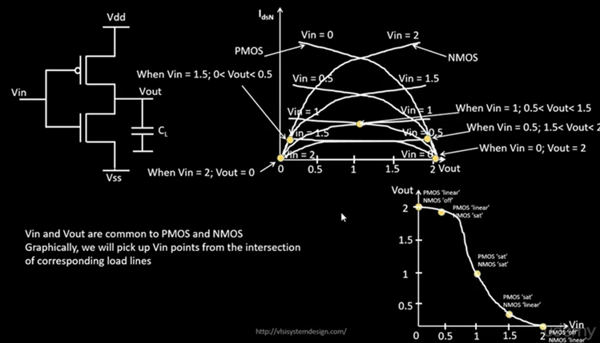

**PMOS Load Curve:**

The PMOS load curve is "flipped" because:
- Vsg = Vdd - Vin (source is at Vdd)
- Current flows from Vdd toward output
- Higher Vin means lower |Vgs|, less current

**Load Curve Superposition:**

When we overlay NMOS and PMOS curves:
- At each Vin, the two transistors must conduct the same current (Kirchhoff’s current law)
- The intersection point gives the operating point (Vout, Id)
- Sweeping Vin from 0 to Vdd traces out the VTC

**Deriving VTC from Load Curves:**


**Process:**
1. For each Vin value, find where NMOS and PMOS curves intersect
2. Read the Vout value (x-coordinate of intersection)
3. Plot Vin vs Vout - this is the Voltage Transfer Characteristic


---


# **Day 3: CMOS switching threshold and dynamic simulations**

On the third day of the workshop the emphasis was on Voltage Transfer Characteristics using SPICE simulations and later on CMOS Inverter Robustness. Many factors were told but only the switching threshold was discussed in depth. An equation relating switching threshold voltage (Vm) and (W/L) ratios of the PMOS and the NMOS was also derived and alternatively, an equation for (W/L) ratios of the PMOS and the NMOS if the Vm is preset was also derived.

## **Part 1: Voltage transfer characteristics and SPICE simulations**

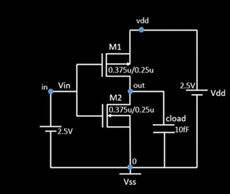

Figure 18. The snap shot of the SPICE netlist considered

- The SPICE code for the above netlist looks something like following:
```
***MODEL Description***
***NETLIST Description***
M1 out in vdd vdd pmos W=0.375u L=0.25u
M2 out in  0   0  nmos W=0.375u L=0.25u

cload out 0 10f

Vdd vdd 0 2.5
Vin  in 0 2.5

***SIMULATION Commands***
.op
.dc Vin 0 2.5 0.05

***.include tsmc_025um_model.mod***
.LIB "tsmc_025um_model.mod" CMOS_MODELS
.end
```

### **_Lab Activity:_**

For plotting the Vtc characteristics of CMOS inverter, the following code is needed:
```
*Model Description
.param temp=27

*Including sky130 library files
.lib "sky130_fd_pr/models/sky130.lib.spice" tt

*Netlist Description

XM1 out in vdd vdd sky130_fd_pr__pfet_01v8 w=0.84 l=0.15
XM2 out in 0 0 sky130_fd_pr__nfet_01v8 w=0.36 l=0.15

Cload out 0 50fF

Vdd vdd 0 1.8V
Vin in 0 1.8V

*simulation commands

.op

.dc Vin 0 1.8 0.01

.control
run
setplot dc1
display
.endc

.end
```

**VTC Characteristics Curve of CMOS:**

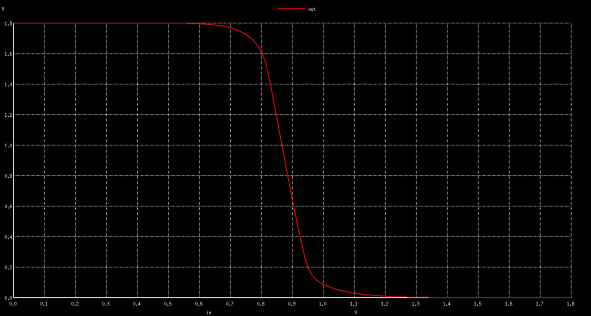

Figure 20. DC sweep plot showing Vout vs Vin characteristics

**Vm Determination Technique:**


- To extract the switching threshold voltage ($V_m$), zoom into the crossover region of the VTC where $V_{out}$ is close to $V_{in}$.
- Use right-click drag to zoom, and repeat until the intersection point is clearly visible.
- Click near the crossover point on the curve.
- The terminal will display the coordinates (typically $x0$ and $y0$).
- At switching threshold, $V_{in} = V_{out}$, so the point where $x0 \approx y0$ gives $V_m$.


For performing the transient analysis, the following code is required:
```
*Model Description
.param temp=27

*Including sky130 library files
.lib "sky130_fd_pr/models/sky130.lib.spice" tt

*Netlist Description

XM1 out in vdd vdd sky130_fd_pr__pfet_01v8 w=0.84 l=0.15
XM2 out in 0 0 sky130_fd_pr__nfet_01v8 w=0.36 l=0.15

Cload out 0 50fF

Vdd vdd 0 1.8V
Vin in 0 PULSE(0V 1.8V 0 0.1ns 0.1ns 2ns 4ns)

*simulation commands

.tran 1n 10n

.control
run
.endc

.end
```

**Transient Analysis - Rise and Fall Delays:**

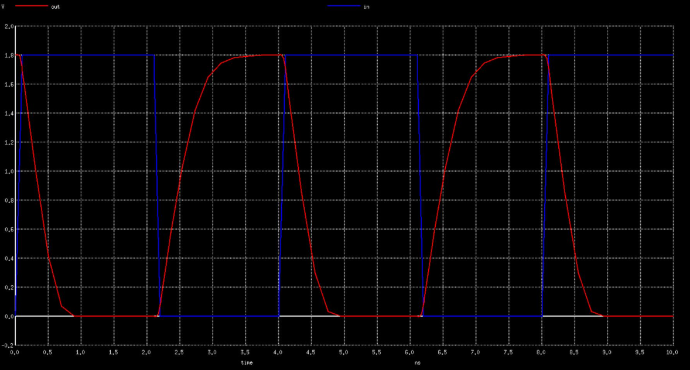

Figure 22. Transient analysis showing input and output pulse waveforms

- To measure rise delay:
   - Zoom into the region where the input is falling and the output is rising, near $V_{DD}/2$.
   - Click the output rising edge at $V_{DD}/2$ and note its time coordinate.
   - Click the input falling edge at $V_{DD}/2$ and note its time coordinate.
   - Compute rise delay as:

     $$
     t_{pLH}=t_{out,rise@V_{DD}/2}-t_{in,fall@V_{DD}/2}
     $$

- To measure fall delay:
   - Zoom into the region where the input is rising and the output is falling, near $V_{DD}/2$.
   - Click the output falling edge at $V_{DD}/2$ and note its time coordinate.
   - Click the input rising edge at $V_{DD}/2$ and note its time coordinate.
   - Compute fall delay as:

     $$
     t_{pHL}=t_{out,fall@V_{DD}/2}-t_{in,rise@V_{DD}/2}
     $$

## **Part 2: Static Behavior Evaluation - CMOS Inverter Robustness: Switching threshold**

- CMOS inverter is a robust device because the shape of it's input versus output curve remains the same for all different values of (W/L) ratios.

**CMOS Inverter Robustness Concept:**

- Static Behavior Evaluation: CMOS Inverter Robustness
    - Switching Threshold
    - Noise Margin
    - Power Supply Variation
    - Device Variatio
    
---


**Switching Threshold ($V_m$)**

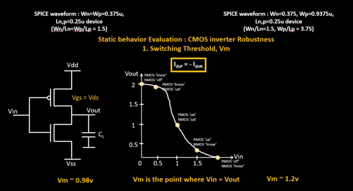

- $V_m$ is the input voltage at which $V_{in} = V_{out}$.
- To find it graphically, draw the 45 degree reference line ($V_{out}=V_{in}$) on the VTC plot. The intersection of this line and the inverter curve gives the switching threshold.
- In this setup, 
   - when $(W_p/L_p)=1.5$ and $(W_n/L_)=1.5$, $V_m \approx 0.98\,V$
   - when $(W_p/L_p)=3.75$ and $(W_n/L_n)=1.5$, $V_m \approx 1.2\,V$
- Here, $W_p$ and $L_p$ are the PMOS channel width and length.
- At $V_m$, both NMOS and PMOS conduct simultaneously (both devices are ON).
- At the switching point, the operating condition is approximately:
   - $V_{GS} \approx V_{DS}$
   - $I_{DSp} = -I_{DSn}$, so $I_{DSp} + I_{DSn} = 0$
- Using these relations, the NMOS and PMOS current equations are written below.

**Calculating Switching Threshold for a given PMOS and NMOS size:**

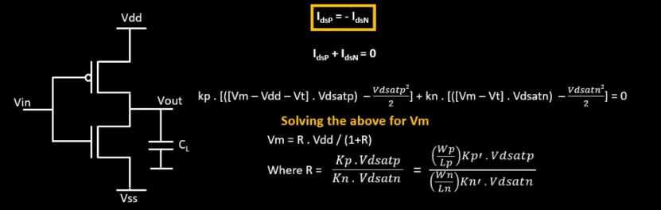

$$
I_{DSp}=-I_{DSn}
$$

$$
I_{DSp}+I_{DSn}=0
$$

$$
k_p\left[(V_m-V_{DD}-V_t)\,V_{DSATp}-\frac{V_{DSATp}^2}{2}\right]
+
k_n\left[(V_m-V_t)\,V_{DSATn}-\frac{V_{DSATn}^2}{2}\right]=0
$$

Solving the above for $V_m$:

$$
V_m=\frac{R\,V_{DD}}{1+R}
$$

where

$$
R=\frac{k_p\,V_{DSATp}}{k_n\,V_{DSATn}}
=
\frac{\left(\frac{W_p}{L_p}\right)k_p'\,V_{DSATp}}{\left(\frac{W_n}{L_n}\right)k_n'\,V_{DSATn}}
$$


**Calculating Ratio of PMOS to NMOS size for a given switching thershold:**

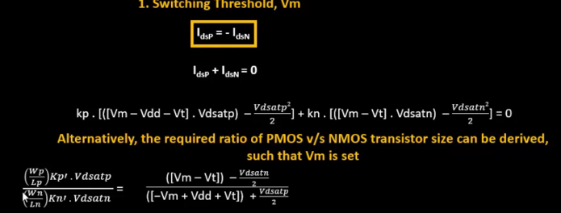


- Here,
    - Wp is the width of the channel in PMOS
    - Lp is the length of the channel in PMOS
    - Wn is the width of the channel in NMOS
    - Ln is the length of the channel in NMOS
    - kn' is the process transconductance of the NMOS
    - kp' is the process transconductance of the PMOS
    - Vdsatn is the Vdsat of the NMOS
    - Vdsatp is the Vdsat of the PMOS
    - Vm is the switching threshold voltage
    - Vt is the threshold voltage
    - Vdd is the supply voltage


### **_Lab Activity:_**

- We experimented with different sizes of PMOS with respect to a particular size of NMOS using spice simulation and found rise delay, fall delay and switching threshold in each case.

|(Wp/Lp)|x.(Wn/Ln)|Rise Delay|Fall Delay|Vm   |
|:---:  |:---:    |:---:     |:---:     |:---:|
|(Wp/Lp)|1.(Wn/Ln)|148pS     |71pS      |0.99V|
|(Wp/Lp)|2.(Wn/Ln)|80pS      |76pS      |1.2V |
|(Wp/Lp)|3.(Wn/Ln)|57pS      |80pS      |1.25V|
|(Wp/Lp)|4.(Wn/Ln)|45pS      |84pS      |1.35V|
|(Wp/Lp)|5.(Wn/Ln)|37pS      |88pS      |1.4V |

- We can make some conclusions from the above table:
    - When `(Wp/Lp) = 2.(Wn/Ln)`, there is an approximately equal rise-fall delay
    - Due to the equal rise-fall delay, `(Wp/Lp) = 2.(Wn/Ln)` create typical characteristics for a clock inverter/buffer
    - The conditions other than `(Wp/Lp) = 2.(Wn/Ln)` can still be used as regular inverters/buffers and these can be preferred for data path

- When Wp/Lp is increased, the rise delay is isgnificantly reduced because time required for the output capacitor to charge decreases significantly and the reason is the availability of a bigger area to charge the capacitor.
- Ideally, the size(PMOS) ~ 2.5\*size(NMOS)


---

# **Day 4: CMOS Noise Margin Robustness Evaluation**

On the fourth day of the workshop, the robustness of a CMOS inverter in terms of noise margins was demonstrated. We learned the concept of noise margins, the different noise margin ranges and the concepts of Voh, Vih, Vil and Vol. Finally, equations of Noise Margin High (NMh) and Noise Margin Low (NMl) were derived in terms of Voh, Vih, Vil and Vol. During the lab activity, the Noise Margins were found for an inverter with (Wp/Lp) = (2.77).(Wn/Ln)

## **Part 1: Static Behavior Evaluation - CMOS Inverter Robustness: Noise Margin**

### **What is Noise Margin?**

**Definition:**
Noise margin is the amount of noise voltage that can be tolerated at the input of a logic gate without causing an erroneous output. It quantifies the immunity of a digital circuit to unwanted electrical disturbances.

**Ideal Inverter Characteristics**

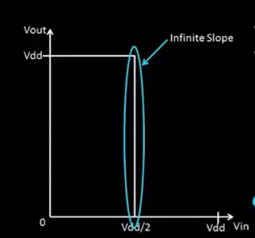

In real digital systems, signals are subject to various noise sources:
- Crosstalk from adjacent wires
- Power supply fluctuations
- Ground bounce
- Electromagnetic interference (EMI)
- Reflections on transmission lines

A robust inverter should be able to:
1. Correctly interpret a noisy '0' as logic LOW
2. Correctly interpret a noisy '1' as logic HIGH
3. Reject noise that falls within acceptable limits

**The Key Voltage Parameters:**

| Parameter | Full Name | Definition |
|-----------|-----------|------------|
| **VIL** | Input Low Voltage | Maximum input voltage recognized as logic '0' |
| **VIH** | Input High Voltage | Minimum input voltage recognized as logic '1' |
| **VOL** | Output Low Voltage | Maximum output voltage when driving logic '0' |
| **VOH** | Output High Voltage | Minimum output voltage when driving logic '1' |

**Practical Inverter**

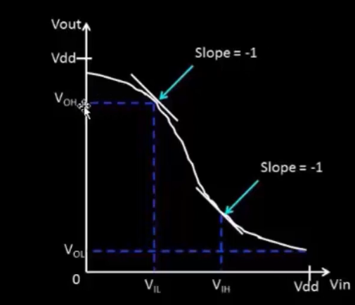

- **VIL**: Point where VTC slope = -1 (lower input)
- **VIH**: Point where VTC slope = -1 (higher input)
- **VOL**: Output corresponding to VIH input
- **VOH**: Output corresponding to VIL input

---

### **Noise Margin Formulas**

**Noise Margin High (NMH):**

```
NMH = VOH - VIH
```

This represents how much noise can be added to a logic '1' output before the next stage interprets it incorrectly.

**Noise Margin Low (NML):**

```
NML = VIL - VOL
```

This represents how much noise can be added to a logic '0' output before the next stage interprets it incorrectly.

---

### **Understanding the Three Voltage Regions**

**Visual Representation:**

The voltage range from 0 to Vdd is divided into three regions:

**1. Valid Logic '0' Region (VIL to VOL):**
- Any input in this range is guaranteed to be interpreted as LOW
- Protected by NML from noise

**2. Undefined Region (VIL to VIH):**
- Input voltage in this range produces unpredictable output
- The logic gate may interpret this as '0' or '1'
- **Must be avoided in proper digital design**

**3. Valid Logic '1' Region (VOH to VIH):**
- Any input in this range is guaranteed to be interpreted as HIGH
- Protected by NMH from noise

**Voltage Levels on the VTC:**

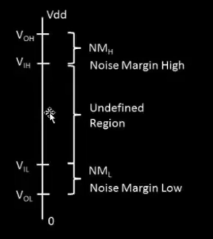

- The undefined region is used for analog design and the other two regions are used for digital design. 

---

### **Noise Bump Analysis**

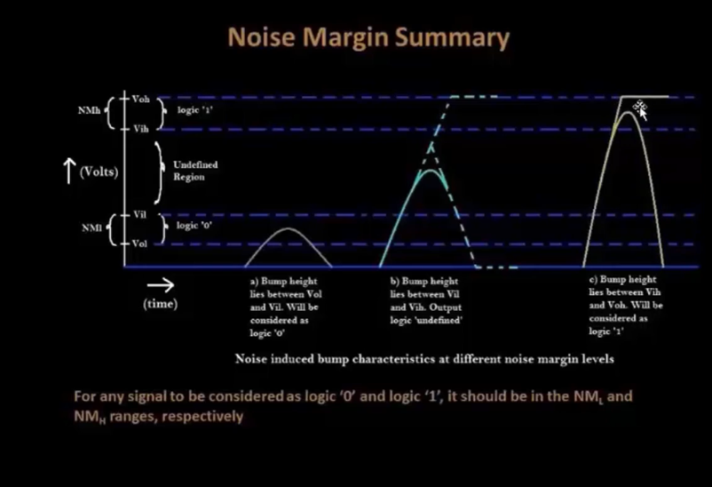


**Case A: Noise bump within NML region (0 to VIL)**
- The bump stays within the valid '0' range
- Receiving gate correctly interprets the signal as '0'
- **Result:** Safe - No error

**Case B: Noise bump into Undefined region (VIL to VIH)**
- The bump enters the uncertain zone
- Receiving gate may interpret signal incorrectly
- **Result:** Dangerous - Potential metastability or error

**Case C: Noise bump within NMH region (VIH to VOH)**
- Even though there's noise, signal stays in valid '1' range
- Receiving gate correctly interprets the signal as '1'
- **Result:** Safe - No error

---

### **Effect of W/L Ratio on Noise Margins**

- We experimented with different sizes of the PMOS with respect to a size of NMOS using spice simulation and found the noise NMH and NML in each case.

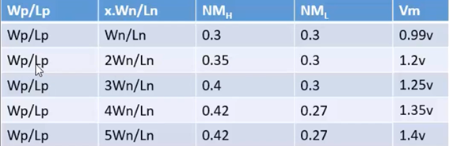

**Analysis of Results:**

1. **NMH Improvement (with larger PMOS):**
   - Stronger PMOS provides better pull-up
   - VOH rises closer to Vdd
   - NMH increases from 0.30V to 0.42V (40% improvement)

2. **NML Stability then Degradation:**
   - Initially NML stable at 0.30V
   - At 4×-5× sizing, NMOS becomes relatively weaker
   - VOL rises slightly, reducing NML to 0.27V

3. **Robustness Conclusion:**
   - Despite W/L ratio changes, noise margins remain acceptable
   - Total variation: NMH varies by 120mV, NML varies by 30mV
   - **CMOS inverter maintains robustness across sizing variations**


---

### **_Lab Activity: Noise Margin Measurement_**

**Objective:** Extract VIL, VIH, VOL, VOH from the VTC and calculate noise margins.

**SPICE Code:**
```
*Model Description
.param temp=27

*Including sky130 library files
.lib "sky130_fd_pr/models/sky130.lib.spice" tt

*Netlist Description

XM1 out in vdd vdd sky130_fd_pr__pfet_01v8 w=1 l=0.15
XM2 out in 0 0 sky130_fd_pr__nfet_01v8 w=0.36 l=0.15

Cload out 0 50fF

Vdd vdd 0 1.8V
Vin in 0 1.8V

*simulation commands

.op

.dc Vin 0 1.8 0.01

.control
run
setplot dc1
display
.endc

.end
```

**Lab Results:**

**Step-by-Step Extraction Process:**

1. **Run ngspice and plot the VTC curve**

2. **Find VIL and VOH (Upper transition point where slope = -1):**
   - Zoom to upper portion of VTC curve
   - Click where the curve slope appears to be -1
   - Recorded: `x0 = 0.766667, y0 = 1.71351`
   - Therefore: **VIL = 0.767V, VOH = 1.713V**

3. **Find VIH and VOL (Lower transition point where slope = -1):**
   - Zoom to lower portion of VTC curve
   - Click where the curve slope appears to be -1
   - Recorded: `x1 = 0.977333, y1 = 0.110811`
   - Therefore: **VIH = 0.977V, VOL = 0.111V**

4. **Calculate Noise Margins:**
   ```
   NMH = VOH - VIH = 1.713 - 0.977 = 0.736V
   NML = VIL - VOL = 0.767 - 0.111 = 0.656V
   ```

**Lab Results Summary:**

| Parameter | Measured Value |
|-----------|----------------|
| VIL | 0.767V |
| VIH | 0.977V |
| VOL | 0.111V |
| VOH | 1.713V |
| **NMH** | **0.736V** |
| **NML** | **0.656V** |

---

**Key Findings from the Lab:**

1. **Excellent Noise Immunity:**
   - Both NMH (0.736V) and NML (0.656V) are significantly larger than typical noise levels
   - Combined noise protection: NMH + NML = 1.39V (77% of Vdd)

2. **Slight Asymmetry:**
   - NMH > NML indicates slightly better protection for logic '1'
   - This is due to the specific W/L ratio: (Wp/Lp) = 2.77×(Wn/Ln)

3. **VTC Quality:**
   - Sharp transition region (VIH - VIL = 0.21V) indicates high gain
   - Small undefined region means clean digital switching

4. **Design Recommendation:**
   - For (Wp/Lp) = 2.77×(Wn/Ln), the inverter provides robust noise margins
   - Suitable for general-purpose digital logic applications


---

# **Day 5: CMOS Power supply and device variation robustness evaluation**

On the fifth and final day of the workshop, we observed the effect of variation of the power supply on the gain of the device and its advantages and disadvantages. We also observed the changes that occur in a device due to manufacturing processes like the etching process and the oxide layer thickness. We also observed the differences between strong PMOS, weak PMOS, strong NMOS and weak NMOS and the variation that occur when we move from Weak PMOS – Strong NMOS to Strong PMOS – Weak NMOS.

## **Part 1: Static Behavior Evaluation - CMOS Inverter Robustness: Power Supply Variation**

### **_Lab Activity:_**

- By varying th values of Vdd, we plot the VTC characteristics of CMOS in each case
- To perform the lab activity for power supply scaling, we need the following code:

```
*Model Description
.param temp=27

*Including sky130 library files
.lib "sky130_fd_pr/models/sky130.lib.spice" tt

*Netlist Description

XM1 out in vdd vdd sky130_fd_pr__pfet_01v8 w=1 l=0.15
XM2 out in 0 0 sky130_fd_pr__nfet_01v8 w=0.36 l=0.15

Cload out 0 50fF

Vdd vdd 0 1.8V
Vin in 0 1.8V

.control

let powersupply = 1.8
alter Vdd = powersupply
        let voltagesupplyvariation = 0
        dowhile voltagesupplyvariation < 6
        dc Vin 0 1.8 0.01
        let powersupply = powersupply - 0.2
        alter Vdd = powersupply
        let voltagesupplyvariation = voltagesupplyvariation + 1
      end

plot dc1.out vs in dc2.out vs in dc3.out vs in dc4.out vs in dc5.out vs in dc6.out vs in xlabel "input voltage(V)" ylabel "output voltage(V)" title "Inveter dc characteristics as a function of supply voltage"

.endc


.end
```

**What it does:**

- Generates 6 separate DC simulations at Vdd = 1.8V, 1.6V, 1.4V, 1.2V, 1.0V, and 0.8V
- Each iteration runs a complete VTC sweep for that supply voltage
- The plot overlays all 6 VTC curves to show how changing supply voltage affects inverter characteristics
- This allows observation of gain improvement and performance degradation at lower supply voltages


Figure 31. The snap shot of the terminal window to observe the power supply variation


Figure 32. The snap shot of the output window to observe the power supply variation


**Gain Variation with Supply Voltage:**

- To calculate the gain for the given plot:
    - Select the curve for which the gain is to be calculated (In this case, we chose the plot for 1.8V Vdd)
    - Left click on the point where the slope of the curve is almost changing toward the top of the plot (point where slope = -1)
    - The point obtained was `x0 = 0.766667, y0 = 1.71351`
    - Now, left click on the point where the slope of the curve is almost changing toward the bottom of the plot
    - The point obtained was `x0 = 0.982667, y0 = 0.1` but for our convenience let us consider the coordinates of the point to be x1, y1
    - Therefore, the point becomes `x1 = 0.982667, y1 = 0.1`
    - Subtract y1 from y0. So, `y0 - y1 = 1.61351`
    - Subtract x1 from x0. So, `x0 - x1 = -0.216`
    - Now, gain = (y0-y1)/(x0-x1)
    - Hence, `Gain(g) = |(1.61351)/(-0.216)| = |-7.46995| = 7.46995`

### **Lab Results Summary - Power Supply Variation:**

| Supply Voltage (Vdd) | Switching Threshold (Vm) | Approximate Gain | Energy Efficiency |
|---------------------|-------------------------|-----------------|-------------------|
| 1.8V | ~0.87V | 7.47 | Baseline |
| 1.6V | ~0.78V | 8.2 | +21% improvement |
| 1.4V | ~0.69V | 9.1 | +40% improvement |
| 1.2V | ~0.60V | 10.5 | +56% improvement |
| 1.0V | ~0.50V | 12.8 | +69% improvement |
| 0.8V | ~0.40V | ~15+ | +80% improvement |

---

### **Day 5 Part 1 Lab Conclusion - Power Supply Variation**

**Key Findings from the Lab:**

1. **Gain Improvement at Lower Supply:**
   - As Vdd decreases from 1.8V to 0.8V, the gain increases significantly
   - At 1.8V: Gain ≈ 7.47
   - At lower voltages: Gain can exceed 15
   - This is because the transition region spans a smaller voltage range

2. **Energy Consumption Advantage:**
   - Dynamic power follows P ∝ Vdd²
   - Reducing Vdd from 1.8V to 0.9V reduces dynamic power by ~75%
   - This is the primary motivation for voltage scaling in modern technology nodes

3. **Performance Trade-off:**
   - Lower Vdd means smaller overdrive voltage (Vgs - Vt)
   - This reduces drain current and increases propagation delay
   - Rise/fall times become longer at lower supply voltages

**Design Recommendation:**
- For high-performance applications: Use nominal Vdd (1.8V)
- For low-power applications: Scale down to 1.0V-1.2V for significant energy savings
- For ultra-low-power: 0.8V possible but with performance penalty

---

## **Part 2: Static Behavior Evaluation - CMOS Inverter Robustness: Device Variation**

### **What is Device Variation?**

Device variation refers to the unintended differences in transistor characteristics that occur during the manufacturing process. Even with precise fabrication, no two transistors are exactly identical. Understanding device variation is critical because it directly affects circuit performance and reliability.

### **_Sources of Device Variation:_**

There are two primary sources for device variation in CMOS fabrication:

**1. Etching Process Variation:**

The etching process defines the physical structures in the layout of the CMOS inverter. During etching, chemical or plasma processes remove material to create the transistor patterns. This process is crucial because it determines the actual width (W) and length (L) of the transistors.

When etching is not perfectly uniform across the wafer:
- Some transistors may have slightly larger W (wider channel → lower resistance → stronger device)
- Some transistors may have slightly smaller W (narrower channel → higher resistance → weaker device)
- Length variations directly affect the technology node we are operating at (20nm, 45nm, etc.)
- During the etching process, there might be a slight variations in W/L ratios of PMOS and NMOS. As a result, the drain to source current of both NMOS and PMOS may slightly differ. 

**2. Oxide Thickness Variation:**

The gate oxide layer (SiO2) separates the gate electrode from the channel. Its thickness (tox) directly affects the gate capacitance through the equation:

```
Cox = εox / tox
```

Where:
- Cox = Gate oxide capacitance per unit area
- εox = Permittivity of silicon dioxide
- tox = Oxide thickness

In an ideal oxidation process, the gate oxide thickness would be constant everywhere. In reality:
- Thickness varies across the wafer
- Center of wafer often has different thickness than edges
- This variation changes Cox, which directly affects drain current (Id ∝ Cox)

### **Device Variration** 

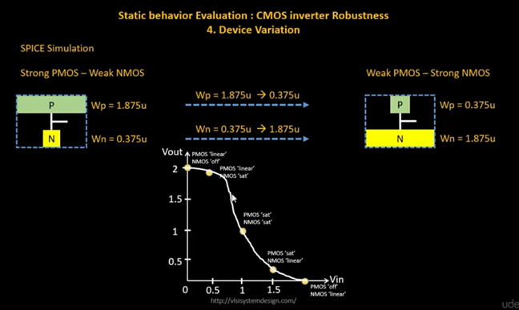

- We plot VTC Characteristics of CMOS by varying the PMOS/NMOS sizes

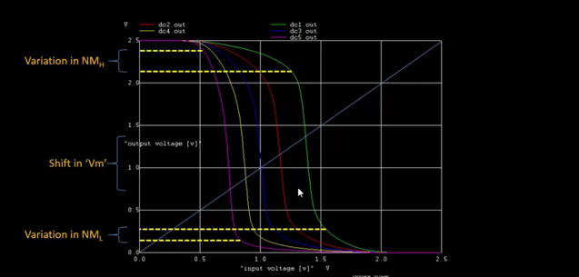

---

### **_Lab Activity - Device Variation:_**

**Objective:** To observe the effect of extreme PMOS/NMOS sizing on switching threshold, simulating the effect of Strong PMOS - Weak NMOS corner.

**SPICE Code:**

```
*Model Description
.param temp=27

*Including sky130 library files
.lib "sky130_fd_pr/models/sky130.lib.spice" tt

*Netlist Description

XM1 out in vdd vdd sky130_fd_pr__pfet_01v8 w=7 l=0.15
XM2 out in 0 0 sky130_fd_pr__nfet_01v8 w=0.42 l=0.15

Cload out 0 50fF

Vdd vdd 0 1.8V
Vin in 0 1.8V

*simulation commands

.op

.dc Vin 0 1.8 0.01

.control
run
setplot dc1
display
.endc

.end
```

**Code Explanation:**
- **PMOS width (W=7)**: Very large width for PMOS - creates a "Strong PMOS"
- **NMOS width (W=0.42)**: Smaller width for NMOS - creates a relatively "Weak NMOS"
- **Ratio: Wp/Wn = 7/0.42 ≈ 16.7**: This extreme ratio shifts Vm significantly
- **DC sweep**: Sweeps input from 0V to 1.8V to generate VTC

**Lab Results - Device Variation:**

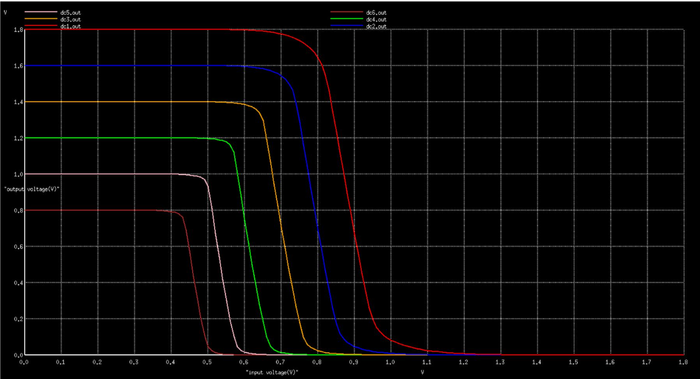

### **Day 5 Part 2 Lab Conclusion - Device Variation**

**Key Findings from the Lab:**

1. **Switching Threshold Shift:**
   - With extreme sizing (Wp/Wn = 16.7), Vm shifts to 0.988V
   - This is ~118mV higher than nominal design (0.87V)
   - The shift is toward Vdd/2 but exceeds it, favoring HIGH output

2. **VTC Shape:**
   - Transition region moves right
   - The inverter spends more input range in the LOW output state
   - Crossover point occurs at a higher input voltage

3. **Noise Margin Impact:**
   - NMH slightly decreases (less headroom for HIGH state)
   - NML increases (more tolerance for LOW state noise)
   - Overall circuit remains functional

4. **Robustness Observation:**
   - Even with 6x deviation in sizing ratio, the inverter works correctly
   - This demonstrates the inherent robustness of CMOS logic
   - The switching behavior is maintained, only threshold shifts

---

# Conclusion

This work presents a complete CMOS inverter study from device physics to circuit-level robustness. The analysis covers NMOS operating regions, velocity saturation effects in short-channel devices, VTC derivation using NMOS/PMOS load-curve intersection, switching-threshold modeling as a function of $(W/L)$ ratios, transient delay extraction, and static robustness metrics including noise margin, supply scaling, and device variation. SPICE-based experiments confirm key design trade-offs: increasing PMOS strength shifts $V_m$ upward and improves rise delay, lower $V_{DD}$ reduces power but increases delay and reduces noise margin, and process/device variations primarily shift the switching point while preserving inverter functionality. Overall, the results provide practical sizing and operating guidelines for balancing speed, power, and robustness in CMOS inverter design.

---

# References

- [https://github.com/kunalg123/sky130CircuitDesignWorkshop](https://github.com/kunalg123/sky130CircuitDesignWorkshop)
- [https://www.vsdiat.com/](https://www.vsdiat.com/)
- [https://www.vlsisystemdesign.com/](https://www.vlsisystemdesign.com/)
- [https://github.com/kunalg123/vsdflow](https://github.com/kunalg123/vsdflow)
